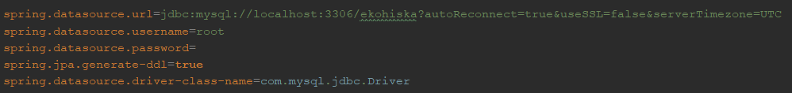
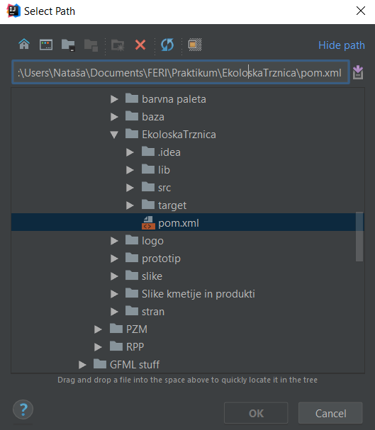

## Kdo smo 
 | | | |
:---: |:---: |:---: |:---: |
[BorsicTeja](https://github.com/BorsicTeja) |[FeherNatasa](https://github.com/FeherNatasa) |[Gornikpina](https://github.com/Gornikpina) |[KitekMaja](https://github.com/KitekMaja) |

Projekt je bil izveden v sklopu predmeta Praktikum 1, FERI ITK UN.
Mentor: Mitja Gradišnik

## Naš projekt 
Sistem v pomoč pri trženju ekoloških izdelkov, ki jih pridelujejo ekološke kmetije.
Vzpostavili smo spletno stran, ki obiskovalcem omogoča pregled ekoloških kmetij ter pregled produktov, ki jih le te ponujajo.
Funkcionalnosti:
* pregled kmetij po regijah, pregled njihovih produktov
* nakup produktov
* dodajanje novih kmetij ter njihovih izdelkov (z obveznimi podatki)
* registracija ter prijava uporabnikov, urejanje profila 
* uporabniki imajo možnost ocenitve ter dodajanja komentarja kmetijam
* iskanje po produktih

## Navodila za namestitev 
Za namestitev našega projekta boste potrebovali nameščen IntelliJ ter MySQL Workbench, ki je nujno potreben za uspešno delovanje projekta. 
Inštalacija MySQL: namestite si uporabniško ime ter geslo za strežnik. 
Ustvarite lokalni strežnik ter na njem novo shemo, v katero vstavite skripto: "povezano.sql" (najdete jo v: EkoloskaTrzniza/SQL/povezano.sql).
Za odprtje projekta: 
1. na našem repozitoriju pri opciji Clone or download, izberite Download.zip. Zip datoteko nato razširite na poljubno mesto v vašem računalniku.
2. v IntelliJ odprite file -> Open -> izberite razširjeno mapo na lokaciji kamor ste jo shranili 
3. omogočiti morate tudi avtomatski izvoz vseh Maven odvisnosti 
3. v apllicationproperties nastavite vaše ime ter geslo za povezavo z bazo (isto kot imate nastavljeno v MySQL), pomembno je tudi da se ujemajo tudi vrata (port) ter ime baze
4. za zagon projekta: view -> Tool Windows -> Maven Project -> izberete datoteko pom.xml
5. Med Plugins izberete Spring-boot, ter nato spring-boot:run
V izbranem brskalniku nato dostopate do spletne aplikacije.

